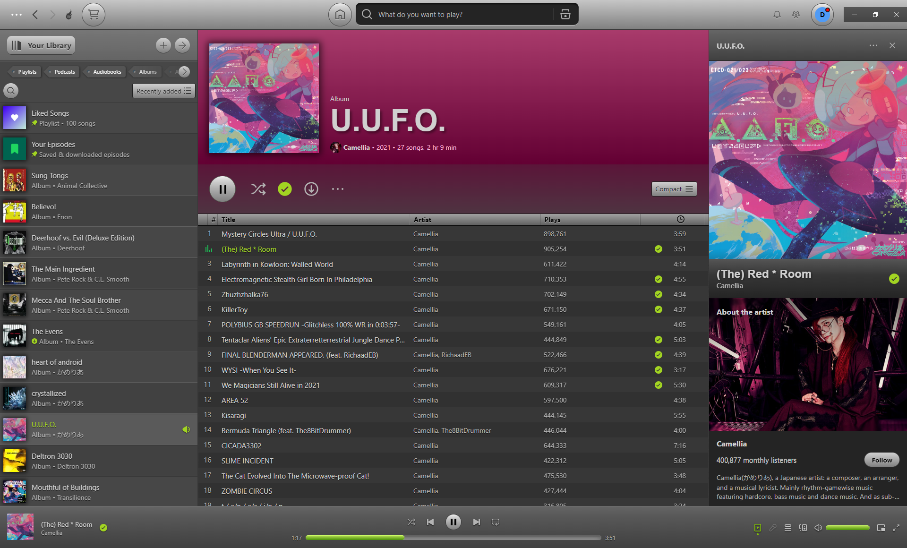
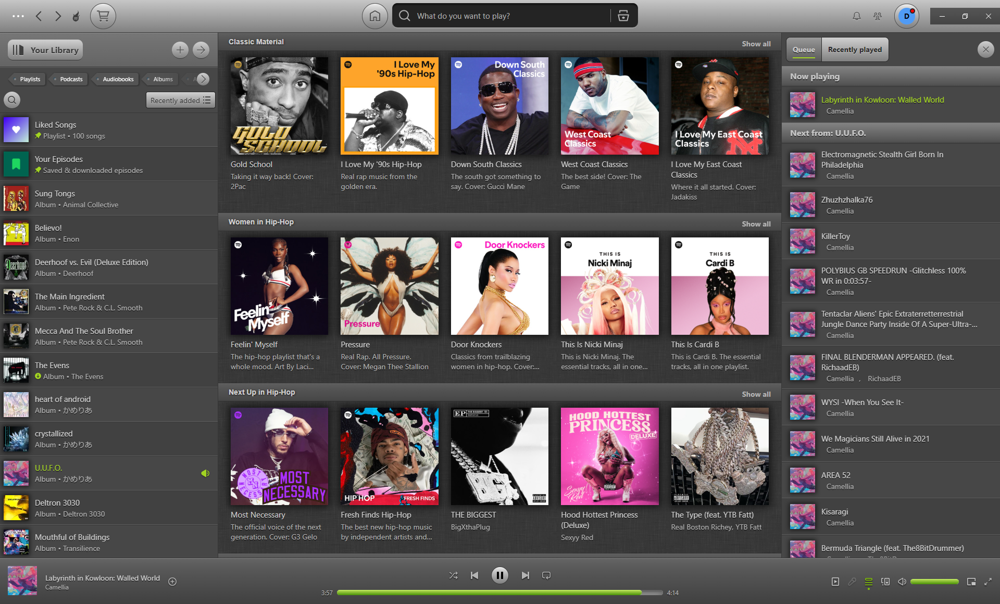

# Spicetify Throwback

**Throwback** is a fun and nostalgic theme for the Spotify Desktop client that is inspired by the original UI design of the Spotify client and early 2010's-era web design.

*Long live skeuomorphism!*




## WARNING - ALPHA VERSION

This theme is **alpha quality software** and various things may break! Please only install this theme at your own risk! I may or may not have time to address all issues in the future!

## Requirements

- Spotify Desktop `v1.2.53.440`
- Spicetify `v2.38.7`

**NOTE:** This theme has only been thoroughly tested on the Spotify desktop client for Windows!

## Installation

Copy the `Throwback` folder to your Spicetify config folder.

Run the following to enable the theme:

```bash
spicetify config current_theme Throwback
spicetify apply
```
